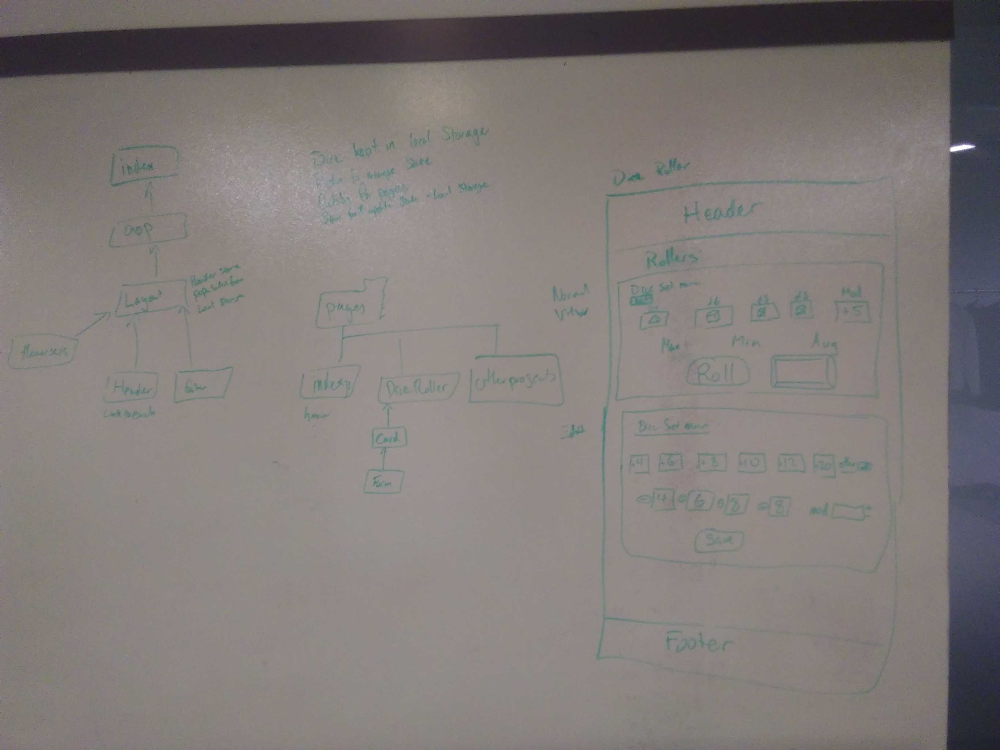

<!-- AUTO-GENERATED-CONTENT:START (STARTER) -->
# D&D Tools React 
 Created by: Aaron Ferris  
 May 30th 2019  

[Most Recent Pull Request](link-to-pull)

## Current Pages/Tools:
* Welcome
* Dice Roller

# Tools Used:
* Github
* Gatsby
* React
* Redux

## Instructions:

* Ensure Gatsby is globally installed
* Run ```npm i``` inside repo
* Run ```gatsby develop``` inside repo to see the current progress
  * This will show up on localhost:8000

## Current Progress:
* Created proof of life with gatsby with a page extension
* High level UML and page layout

